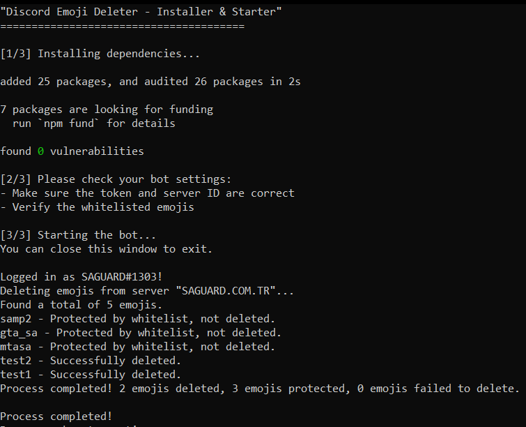

# discord-emoji-deleter

A simple tool to bulk delete emojis from your Discord server while allowing whitelisted emojis to remain. Features rate limit protection and an easy setup process.

## Features
- **Emoji Whitelist:** Specify emojis that should not be deleted.
- **Rate Limit Protection:** Prevents hitting Discord's rate limits.
- **Easy Setup & Start:** Just configure the `config.json` file and run `start.bat`.

## Requirements
- Node.js **v22.12.0**
- A clean heart ❤️

## Installation & Usage
1. Download or clone the repository.
2. Open `config.json` and set:
   - Your **bot token**
   - Your **guild ID**
   - List of **whitelisted emojis**
3. Run `start.bat` to start the script.

## Screenshot

